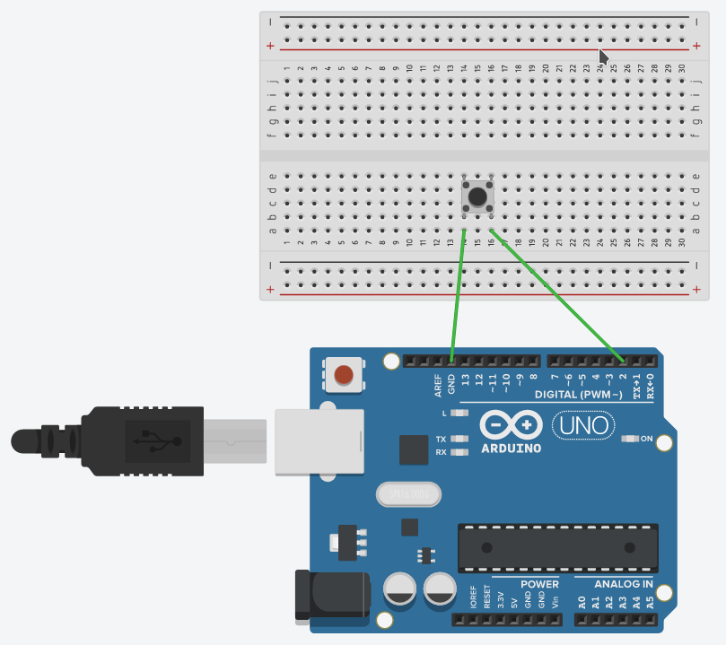
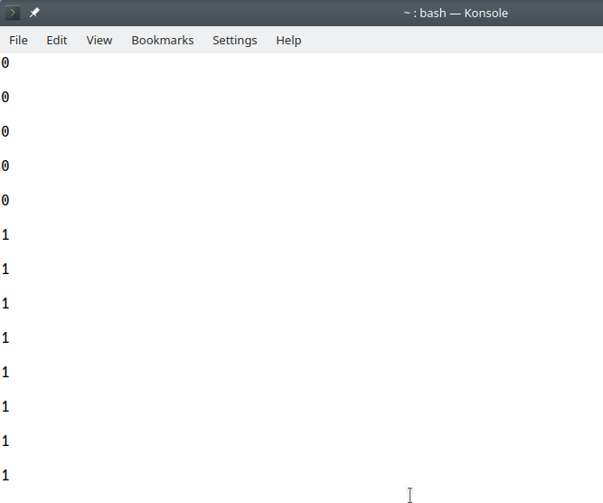
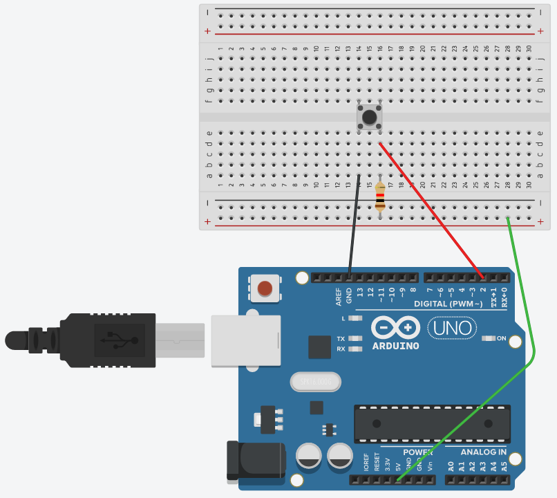
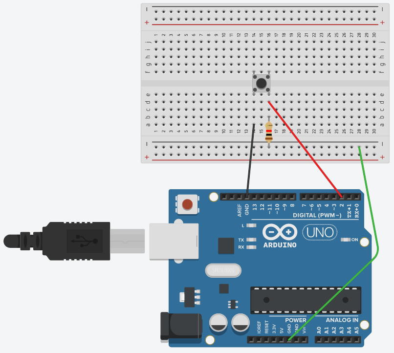
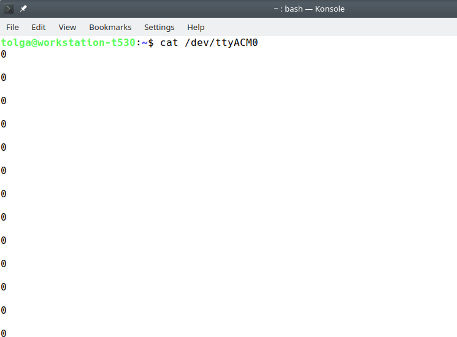

# Arduino - Floating Pin and Pull-down and Pull-up Resistors
For the past couple of days I was struggling to understand what are the pull-down and pull-up resistors in the circuits. I finally grasped it and wanted to document it, hoping that it would be useful:

So, a state of a pin in a circuit can either be:
- ON (True, +, 1)
- OFF (False, -, 0)
- Floating

In the floating state, the pin could be in either state and it could be changing its state _randomly_.

We can simulate this with the help of Arduino with a very simple circuit:



As you see, the digital pin is connected to the + side of the toggle button and the GND to the - side. Make sure you are using the digital pin in your Arduino.

After we build the circuit, our code is pretty much simple: we will activate the serial monitor to read the pin value and write it to the serial monitor:

``` C++
const int read_pin = 2;

void setup() {

  Serial.begin(9600);
  pinMode(read_pin, INPUT);

}

void loop() {
  int pin_state;
  pin_state = digitalRead(read_pin);
  Serial.println(pin_state);

}
```

If we check the serial monitor (or cat /dev/ttyACM0 in Linux), we will see that the pin changes state randomly:



So how will we be able to use the toggle button - is it ON or OFF? It is worse: it is in an unknown (floating) state.

Again, how will we be able to use the toggle button? The only way is to make sure that its state is either ON or OFF. We can do that using a resistor:

- Set the state to OFF. That is 0, so we are _pulling down_.
- Set the state to ON. That is 1, so we are _pulling up_.

To be able to do that, we can use a resistor in the 3 kΩ – 10 kΩ range. If we use a resistor lower that 3 kΩ or higher than 10 kΩ, we risk having a voltage or current that might affect the whole circuit.

We can make the connections as in the following sketches. Pay attention that, if we are creating a pull-down resistor, the connection goes to the GND pin and if we are creating a pull-up resistor, the connection goes to the 5V pin:





If we check the serial console, say for the pull-down resistor, we see that the state is ON:

